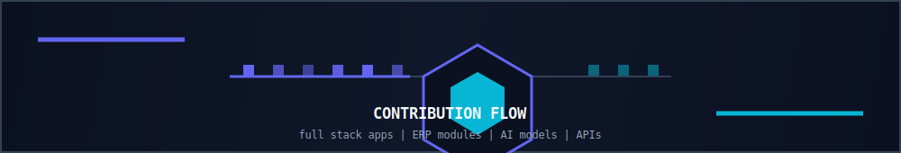

<p align="center">
  
</p>

<p align="center">
  
</p>

<h1 align="center">سليمان حمود الصباحي</h1>
<h3 align="center">Soliman Alsabahi · Full Stack Developer</h3>

<p align="center">
  <strong>من صنعاء، اليمن</strong> · Sana'a, Yemen<br/>
  <span>Angular · Flutter · ASP.NET Core · Odoo · Python · AI</span>
</p>

<p align="center">
  <a href="https://linkedin.com/in/soliman-alsabahi-34361a318">
    
  </a>
  <a href="mailto:solimanalsabahi808@gmail.com">
    
  </a>
  <a href="https://wa.me/967774573976">
    
  </a>
  <a href="https://github.com/3soliman">
    
  </a>
</p>

<p align="center">
  
</p>

<p align="center">
  
</p>

## 👋 من أنا | About Me

أنا **مطور Full Stack** من صنعاء، اليمن. خريج **بكالوريوس نظم المعلومات** من جامعة صنعاء — كلية الحاسوب (2025).

أبني أنظمة ويب وتطبيقات ذكية للشركات: **منصات حجوزات، ERP، فواتير، لوحات تحكم، وذكاء اصطناعي** — من الفكرة حتى النشر.

```txt
Full Stack Dev     Odoo Modules      Flutter Apps
Angular Web        ASP.NET Core API  AI / ML Models
Booking Systems    ERP Integration   Dashboards
```

<p align="center">
  
  
  
  
</p>

---

## 🎯 مجالات عملي | What I Build

<table>
  <tr>
    <td width="50%" valign="top">
      <h3>🌐 تطوير Full Stack</h3>
      <p>مواقع Angular، APIs بـ ASP.NET Core، تطبيقات Flutter، وربط الأنظمة عبر REST و JWT.</p>
    </td>
    <td width="50%" valign="top">
      <h3>📦 أنظمة ERP و Odoo</h3>
      <p>موديولات مخصصة، صلاحيات، Record Rules، تقارير QWeb، وربط Odoo مع أنظمة خارجية.</p>
    </td>
  </tr>
  <tr>
    <td width="50%" valign="top">
      <h3>🏨 منصات الحجوزات</h3>
      <p>أنظمة حجز عقارات وسياحة مع دفع إلكتروني، لوحات إدارة، وتكامل محاسبي.</p>
    </td>
    <td width="50%" valign="top">
      <h3>🤖 ذكاء اصطناعي</h3>
      <p>نماذج TensorFlow و Scikit-learn مدمجة في تطبيقات عملية — من جمع البيانات حتى النشر.</p>
    </td>
  </tr>
</table>

---

## 🛠️ التقنيات | Tech Stack

<p align="center">
  
  
  
  
  
  
  
  
  
  
  
  
  
  
</p>

---

## 🚀 أبرز المشاريع | Featured Projects

<table>
  <tr>
    <td width="50%" valign="top">
      <h3>🧠 NutriMind AI — تطبيق التغذية الذكي</h3>
      <p>نموذج AI مبني من الصفر بدقة <strong>91.4%</strong> — توصيات غذائية ورياضية مخصصة عبر Flutter و TensorFlow.</p>
      <code>Flutter · Python · TensorFlow · Scikit-learn</code>
    </td>
    <td width="50%" valign="top">
      <h3>🏠 SKN — منصة حجوزات العقارات</h3>
      <p>نظام حجوزات متكامل: Flutter + Angular + ASP.NET Core + Paymob + نشر على سيرفر حقيقي.</p>
      <code>Flutter · Angular · ASP.NET Core · JWT · Paymob</code>
    </td>
  </tr>
  <tr>
    <td width="50%" valign="top">
      <h3>🩺 تطبيق إدارة التشخيص</h3>
      <p>إدارة تشخيص المريض، إنتاج الوصفة العلاجية، وتصدير PDF — مبني بـ Flutter.</p>
      <code>Flutter · SQLite · PDF</code>
    </td>
    <td width="50%" valign="top">
      <h3>✈️ نظام حجوزات سياحية + Odoo</h3>
      <p>ERP لحجوزات السفر مع ربط محاسبي Odoo، برامج سياحية، وفواتير آلية.</p>
      <code>Odoo · Python · ERP · XML-RPC</code>
    </td>
  </tr>
  <tr>
    <td width="50%" valign="top">
      <h3>🌾 تطبيق الرعوي — إدارة المحاصيل</h3>
      <p>متابعة دورة الزراعة من الزرع إلى الحصد مع حسابات المدخولات والمصروفات.</p>
      <code>Flutter · Firebase · SQLite</code>
    </td>
    <td width="50%" valign="top">
      <h3>🔧 خدماتي — منصة الخدمات</h3>
      <p>ربط العملاء بالمهنيين مع دردشة فورية وتصنيفات خدمات متعددة.</p>
      <code>Flutter · Firebase · REST API</code>
    </td>
  </tr>
</table>

<p align="center">
  <a href="https://github.com/3soliman?tab=repositories">
    
  </a>
</p>

---

## 💼 الخبرة | Experience

| الدور | الشركة | الفترة |
|-------|--------|--------|
| مطور Full Stack | Creative Point | 05/2024 – 07/2024 |

> تطوير تطبيقات ويب ودمج ميزات الذكاء الاصطناعي، والتعاون مع الفريق لتحسين تجربة المستخدم.

---

## 📝 المدونة | Blog Topics

<p align="center">
  
  
  
  
  
  
</p>

---

## 💡 فلسفتي في التطوير

> **الحل العملي أولاً.** أنظمة واضحة، قابلة للصيانة، وجاهزة للإنتاج.

أؤمن أن التقنية يجب أن تخدم العمل الحقيقي — سواء ERP لشركة، منصة حجوزات، أو نموذج ذكاء اصطناعي يحل مشكلة يومية.

---

## 📊 GitHub Analytics

<p align="center">
  
  
</p>

<p align="center">
  
  
</p>

## 🏆 Achievements

<p align="center">
  
</p>

## 🐍 Contribution Snake

<p align="center">
  <picture>
    <source media="(prefers-color-scheme: dark)" srcset="https://raw.githubusercontent.com/3soliman/3soliman/output/github-contribution-grid-snake-dark.svg" />
    
  </picture>
</p>

## 📈 Contribution Flow

<p align="center">
  
</p>

<p align="center">
  
</p>

<p align="center">
  <strong>التقنية ليست كوداً فقط — إنها حل يُبنى من الفكرة حتى الإنتاج.</strong><br/>
  <em>Technology isn't just code — it's a solution built from idea to production.</em>
</p>

<p align="center">
  
  
  
</p>
