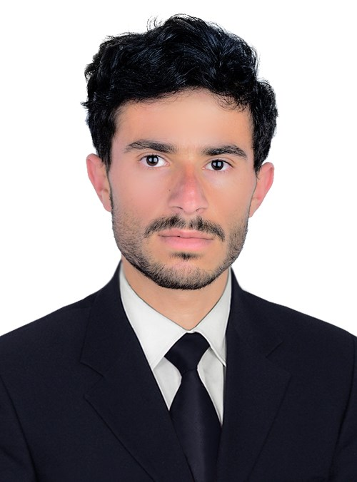
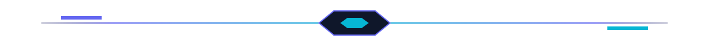

<p align="center">
  
</p>

<table width="100%">
  <tr>
    <td width="150" align="center" valign="top">
      
    </td>
    <td valign="top" align="right" dir="rtl">
      <h2>سليمان حمود الصباحي</h2>
      <p><strong>Soliman Alsabahi</strong> · مطور Full Stack</p>
      <p>من <strong>صنعاء، اليمن</strong> — أبني أنظمة ويب وتطبيقات ذكية: حجوزات، ERP، فواتير، لوحات تحكم، وذكاء اصطناعي.</p>
      <p>خريج <strong>بكالوريوس نظم المعلومات</strong> — جامعة صنعاء، كلية الحاسوب <strong>2025</strong></p>
    </td>
  </tr>
</table>

<p align="center">

| **3+** | **12+** | **Full Stack** | **2025** |
| :--: | :--: | :--: | :--: |
| سنوات خبرة | مشروع منجز | التخصص الرئيسي | نظم المعلومات |

</p>

<p align="center">
  <a href="https://linkedin.com/in/soliman-alsabahi-34361a318">
    
  </a>
  <a href="mailto:solimanalsabahi808@gmail.com">
    
  </a>
  <a href="https://wa.me/967774573976">
    
  </a>
  <a href="https://github.com/3soliman">
    
  </a>
</p>

<p align="center">
  
</p>

<p align="center">
  
</p>

<div align="right" dir="rtl">

أنا مطور **Full Stack** متخصص في بناء حلول متكاملة للشركات — من تحليل المتطلبات حتى النشر على السيرفر.

```
Full Stack Dev     Odoo Modules      Flutter Apps
Angular Web        ASP.NET Core API  AI / ML Models
Booking Systems    ERP Integration   Dashboards
```

</div>

<p align="center">
  
</p>

<div align="right" dir="rtl">

| | |
| :-- | :-- |
| **🌐 تطوير Full Stack** | **📦 أنظمة ERP و Odoo** |
| مواقع Angular، APIs بـ ASP.NET Core، تطبيقات Flutter، وربط الأنظمة عبر REST و JWT | موديولات مخصصة، صلاحيات، Record Rules، تقارير QWeb، وربط Odoo مع أنظمة خارجية |
| **🏨 منصات الحجوزات** | **🤖 ذكاء اصطناعي** |
| أنظمة حجز عقارات وسياحة مع دفع إلكتروني، لوحات إدارة، وتكامل محاسبي | نماذج TensorFlow و Scikit-learn مدمجة في تطبيقات عملية — من جمع البيانات حتى النشر |

</div>

<p align="center">
  
</p>

<p align="center">
  
</p>

<p align="center">
  
</p>

<div align="right" dir="rtl">

| المشروع | الوصف | التقنيات |
| :-- | :-- | :-- |
| **🧠 NutriMind AI** | نموذج AI مبني من الصفر بدقة **91.4%** — توصيات غذائية ورياضية مخصصة | Flutter · Python · TensorFlow |
| **🏠 SKN — حجوزات العقارات** | نظام حجوزات متكامل مع دفع Paymob ونشر على سيرفر حقيقي | Flutter · Angular · ASP.NET Core |
| **🩺 إدارة التشخيص** | إدارة تشخيص المريض، إنتاج الوصفة العلاجية، وتصدير PDF | Flutter · SQLite · PDF |
| **✈️ حجوزات سياحية + Odoo** | ERP لحجوزات السفر مع ربط محاسبي Odoo وفواتير آلية | Odoo · Python · XML-RPC |
| **🌾 الرعوي — المحاصيل** | متابعة دورة الزراعة من الزرع إلى الحصد مع حسابات مالية | Flutter · Firebase · SQLite |
| **🔧 خدماتي — منصة الخدمات** | ربط العملاء بالمهنيين مع دردشة فورية وتصنيفات خدمات | Flutter · Firebase · REST API |

</div>

<p align="center">
  <a href="https://github.com/3soliman?tab=repositories">
    
  </a>
</p>

<blockquote align="center" dir="rtl">
  <strong>فلسفتي:</strong> الحل العملي أولاً — أنظمة واضحة، قابلة للصيانة، وجاهزة للإنتاج.
</blockquote>

<p align="center">
  
</p>

<div align="right" dir="rtl">

| الدور | الشركة | الفترة |
| :-- | :-- | :-- |
| مطور Full Stack | Creative Point | 05/2024 – 07/2024 |

تطوير تطبيقات ويب ودمج ميزات الذكاء الاصطناعي، والتعاون مع الفريق لتحسين تجربة المستخدم.

</div>

<p align="center">
  
</p>

<div align="right" dir="rtl">

| الموضوع |
| :-- |
| شرح صلاحيات Odoo |
| Access Rights vs Record Rules |
| ربط Odoo مع أنظمة خارجية |
| JWT Authentication |
| بناء Dashboard باستخدام React |
| تصميم نظام حجوزات سياحية |

</div>

<p align="center">
  
</p>

<p align="center">
  
  
</p>

<p align="center">
  
  
</p>

<p align="center">
  
</p>

<p align="center">
  
</p>

<p align="center">
  <picture>
    <source media="(prefers-color-scheme: dark)" srcset="https://raw.githubusercontent.com/3soliman/3soliman/output/github-contribution-grid-snake-dark.svg" />
    
  </picture>
</p>

<p align="center">
  
</p>

<p align="center">
  
  
  
</p>
